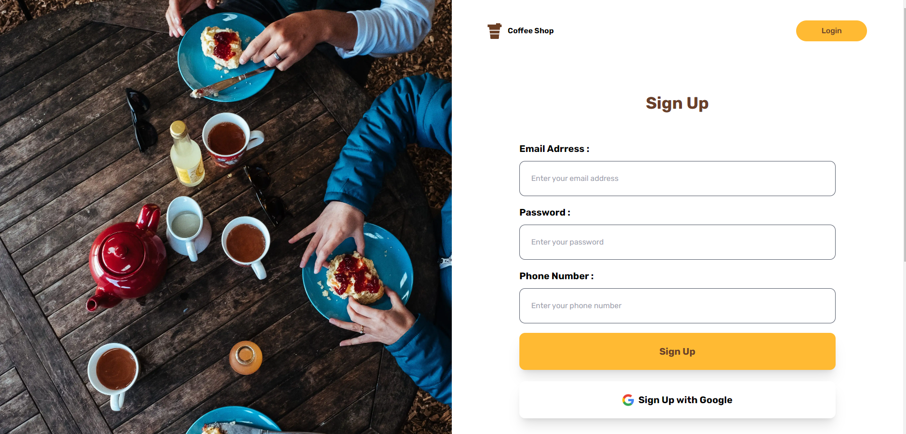
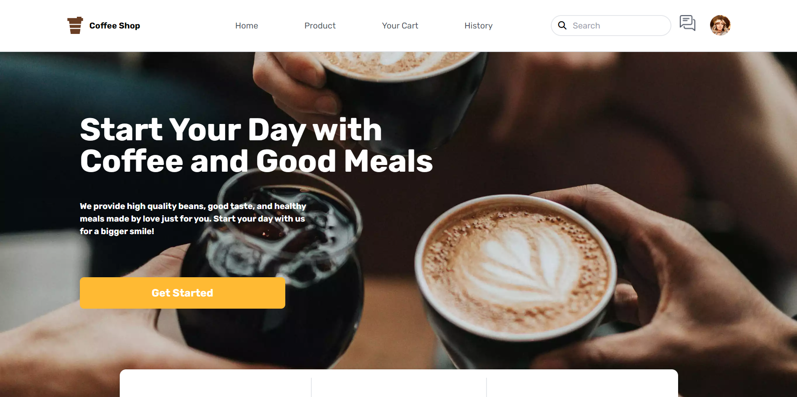
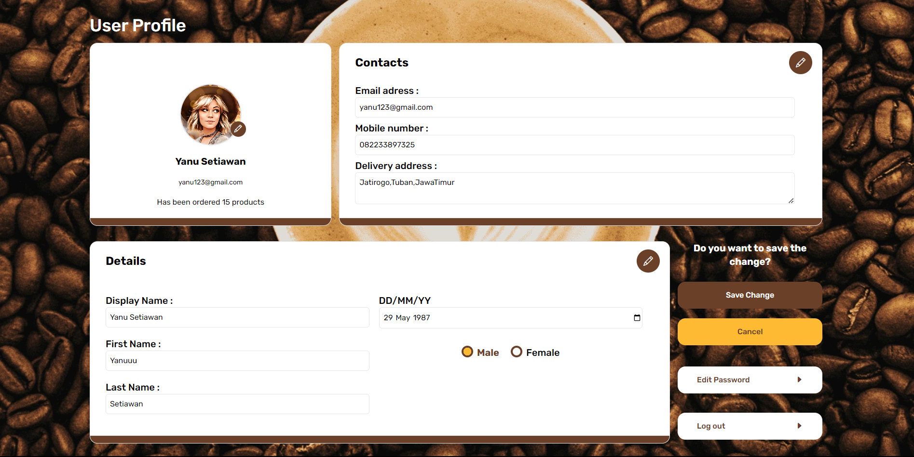
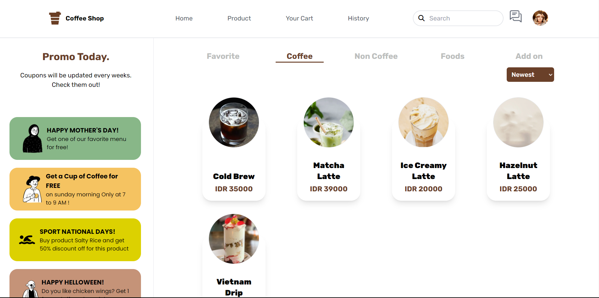

<a id="readme-top"></a>

<!-- PROJECT LOGO -->
<br />
<div align="center">
  <a href="#">
    
  </a>

  <h2 align="center">Coffee Shop</h2>

  <p align="center">
    <a href="https://coffee-shop-react-app-tawny.vercel.app/">View Demo</a>
    ·
    <a href="#">Report Bug</a>
    ·
    <a href="#">Request Feature</a>
  </p>
</div>

## Built With

<p align="center">
  <a href="https://skillicons.dev">
    
  </a>
</p>

<p align="right">(<a href="#readme-top">back to top</a>)</p>

## Contents

- [Features](#features)
- [Run Application](#how-to-run-the-application)
- [Deployment](#deployment)
- [Related Projects](#related-projects)
- [Contributors](#contributors)

## Features

### Customer

- Auth
  - Login
  - Logout
- User
  - Register
  - Forgot Password
  - Edit Profile
- Product
- Promo
- Transaction

### Admin

- Auth
  - Login
  - Logout
- User
  - Forgot Password
- Product
  - Add Product
  - Edit Product
- Promo
  - Add Promo
  - Edit Promo
- Transaction
  - Edit Transaction


## How to Run the Application

### 1. Clone this repository

Clone this repository by run the following code:

```
$ git clone https://github.com/yanu-setiawan/Coffee-Shop-React-App.git
```

### 2. Install dependency packages

Install dependency packages by run the following code inside project folder:

```
$ npm install
```

### 3. Configure .env file

Configure .env file by create file named .env inside project folder and add this line to the file:

```
REACT_APP_SERVER_HOST = https://example.com

```

### 4. Run projects

Run this projects by run the following code:

```
$ npm run dev
```

It runs the app in the development mode.\
Open [http://localhost:3000](http://localhost:3000) to view it in your browser.

The page will reload when you make changes.\
You may also see any lint errors in the console.

## Deployment

[Vercel deploy link](https://coffee-shop-react-app-tawny.vercel.app/)

<p align="right">(<a href="#readme-top">back to top</a>)</p>

## Contributing


1. Fork the Project
2. Create your new Branch ( `git checkout -b ...` )
3. Commit your Changes ( `git commit -m '...'` )
4. Push to the Branch ( `git push origin ...` )
5. Open a Pull Request


<p align="right">(<a href="#readme-top">back to top</a>)</p>

## Deployment

[Vercel deploy Link](https://fazzpay-next-js.vercel.app/)

<p align="right">(<a href="#readme-top">back to top</a>)</p>

## Related Projects

[Coffee-Shop Website](https://github.com/yanu-setiawan/Coffee-Shop-React-App)
[Coffee-Shop Backend](https://github.com/yanu-setiawan/Coffee-Shop-Backend)

<p align="right">(<a href="#readme-top">back to top</a>)</p>

## Documentation







<p align="center"> <samp><i>&copy; yanusetiawan </i></samp> </p>
